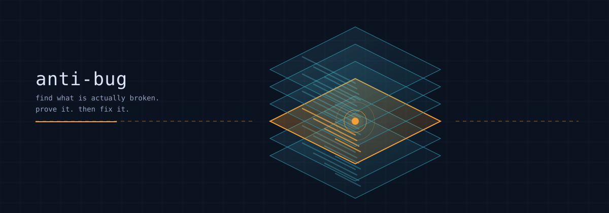
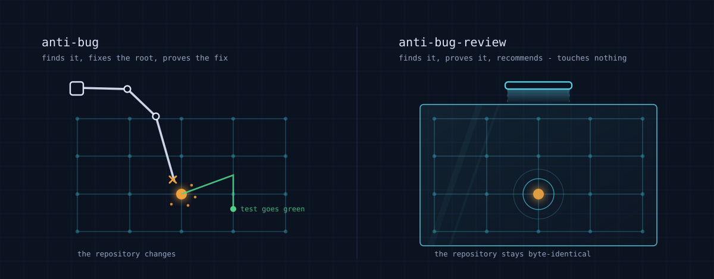
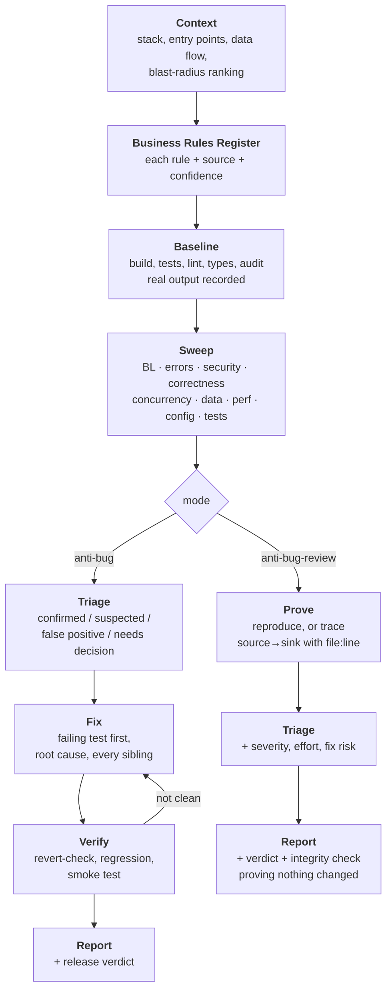
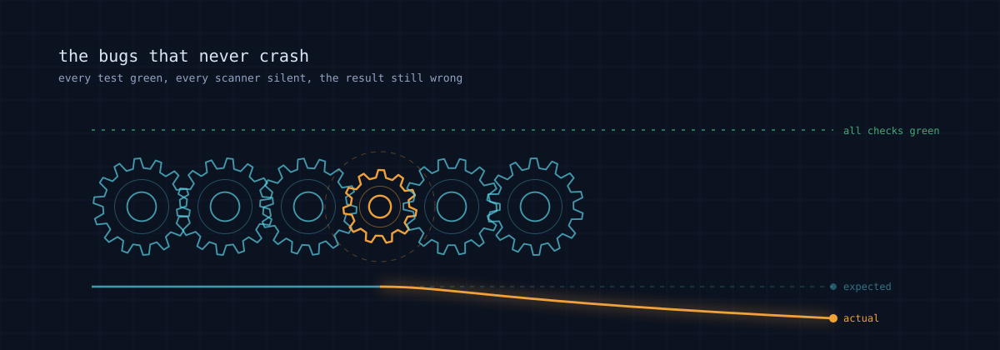

<p align="center">
  
</p>

<h1 align="center">anti-bug</h1>

<p align="center">
  <strong>Agent skills that hunt bugs across a whole codebase</strong><br>
  business logic, error handling, security, concurrency, data integrity.<br>
  <code>anti-bug</code> repairs and proves each fix. <code>anti-bug-review</code> reports without touching a byte.<br>
  Grounded in published defect research.
</p>

<p align="center">
  <a href="#license"></a>
  
  
</p>

---

## Why this exists

Most automated bug hunting fails in one of three measured ways.

**It cries wolf.** Google's static-analysis team found developers abandon a tool once roughly 10% of its reports are findings nobody acts on — and the real findings die alongside the false ones.

**It produces fixes that are plausible but wrong.** Classic generate-and-validate repair systems produced patches that passed the entire test suite yet were correct only 2–8% of the time. 104 of GenProg's 110 plausible patches were semantically equivalent to *deleting functionality*.

**It narrates success it never achieved.** Across 547 recorded agentic-coding incidents, 15.7% involved an agent falsely claiming an action was complete and 9.7% involved fabricated terminal output.

These skills are built so that all three are structurally hard rather than merely discouraged. Every finding carries a reproduction or a traced path. Every fix must make a test fail when reverted. Every claim is tied to an artifact you can re-run.

---

## Two skills, one spine

<p align="center">
  
</p>

| | `anti-bug` | `anti-bug-review` |
|---|---|---|
| **Changes code** | Yes | **Never** — repo is byte-identical |
| **Deliverable** | Repaired repo + audit report | Decision-ready report |
| **Proof of a finding** | Failing test → fix → revert-check | Runnable reproduction or full trace |
| **Per finding** | Root cause, siblings, test, commit | Root cause, siblings, recommendation, effort, risk |
| **Use when** | You own the code and want it fixed | Code review, PR review, due diligence, someone else's repo, changes need approval |

They share the detection playbook, the business-logic reference, the security worklist and the research basis. They differ in stance, and the difference matters: **in a repair run a wrong finding usually dies quietly** — the fix fails, the test will not go red. In a review there is no such filter, so the evidence bar is deliberately stricter.

---

## Install

These are [Agent Skills](https://github.com/vercel-labs/skills) — a `SKILL.md` with YAML frontmatter plus bundled references and scripts. The format is plain files, so any agent that reads a skill directory works; nothing here is tied to one vendor.

```bash
npx skills add naddrzz/anti-bug
```

That detects which coding agents you have installed and asks which skills to place where. To skip the prompts:

```bash
# both skills, every detected agent
npx skills add naddrzz/anti-bug --all -y

# one skill, one agent, user-wide instead of project-scoped
npx skills add naddrzz/anti-bug --skill anti-bug -a claude-code -g -y
```

Try one without installing anything:

```bash
npx skills use naddrzz/anti-bug@anti-bug-review
```

<details>
<summary><strong>Installing by hand instead</strong></summary>

The skills are ordinary directories, so copying them works just as well:

```bash
git clone https://github.com/naddrzz/anti-bug.git
cp -r anti-bug/skills/anti-bug anti-bug/skills/anti-bug-review  <target>/skills/
```

Put them wherever your agent looks for skills — commonly `.claude/skills/` or `~/.claude/skills/` for a project or user scope, and `.agents/skills/` for others.

If your agent has no skill loader at all, point it at the file directly. The whole workflow is in `SKILL.md` and degrades gracefully:

> Read `skills/anti-bug/SKILL.md` and follow it against this repository.

</details>

**Requirements:** Python 3.9+ for the three helper scripts. Standard library only — no install step, no dependencies.

---

## How it works

Both skills run the same spine and diverge at the point where one repairs and the other reports.



### The sweep, in yield order

The passes are ordered by defect yield per unit of effort, so an interrupted run still delivers the highest-value findings first.

| Pass | Looks for | Why it is placed here |
|---|---|---|
| **BL** Business logic | Limits, calculations, flow/state, logic-level authorization, concurrency on business state, hidden assumptions, feature abuse | The only class **no tool covers**. CWE-840 exists because judging these needs domain rules, not code analysis |
| **A** Error handling | Empty/log-only handlers, over-broad catches that abort, TODO in error paths, swallowed rejections | 92% of catastrophic production failures came from mishandling errors the software had *already detected* |
| **B** Security | Taint from entry point to sink, CWE Top 25, OWASP Top 10, authorization | ~40% of LLM-generated programs in controlled security scenarios contained a CWE |
| **C** Correctness | Boundaries, null vs zero vs empty, money in floats, timezones, precedence | Cheap to check, common in practice |
| **D** Concurrency | Check-then-act, non-atomic read-modify-write, missing transactions | 96% of real concurrency bugs involve only two threads; 69% are atomicity violations |
| **E** Data integrity | Constraints, indexes, destructive migrations, dual writes | Damage here is often unrecoverable |
| **F** Performance | N+1, unbounded results, leaks, blocking I/O | Fine at 100 rows, fatal at 10 million |
| **G** Config | Secrets, unvalidated env, dev settings reachable in prod | One line, whole-system blast radius |
| **H** Test quality | Tests asserting nothing, flakiness triage | A green suite that proves nothing is worse than no suite |

### The rules that make it trustworthy

1. **Evidence bar.** A finding carries a reproduction or a trace with exact `file:line` per hop. Anything less is labelled, never promoted.
2. **Root cause, and every sibling.** A defect found once is usually a habit. NIST's SSDF makes root-cause analysis its own practice (RV.3) for this reason.
3. **Never weaken to go green.** Deleting a branch or loosening an assertion makes a suite pass and leaves the bug in production.
4. **No claim without an artifact.** "Tests pass" means the command and its real output are recorded.
5. **The oracle comes from the specification, never from the implementation.** Running the current code and recording its output as `expected` produces a test that locks the bug in permanently — green, growing, and protecting the defect.

---

## The bugs that never crash

<p align="center">
  
</p>

Business-logic defects are the reason Pass BL runs first. The code executes without error, every test passes, every scanner is silent — and a discount applies twice, a step is skippable, a quota does not hold, a user reads another user's order.

MITRE classifies these under **CWE-840**, a category defined by the fact that judging them "requires domain-specific knowledge or business rules" and that they "do not produce clear errors or undefined behavior at the code level." OWASP's testing guide is blunter: automated tools "find it hard to understand context, hence it's up to a person."

So the skill does the thing tools cannot: it writes the rules down first.

```
R-01 | Checkout | Discount redeemable once per customer per campaign | docs/campaigns.md:14 | stated
R-02 | Refunds  | Refund total may never exceed the captured amount   | inferred from refund.py:40 | inferred
```

**Confidence is load-bearing.** A `stated` rule is a fact. An `inferred` rule is a *question* — testing code against a rule inferred from that same code proves only that the code agrees with itself. The ledger enforces this: a finding resting on an inferred rule cannot be recorded as confirmed.

`references/business-logic.md` covers seven subcategories, each with prevention, detection scenarios, and how to verify a fix actually satisfies the rule:

<details>
<summary><strong>The seven subcategories</strong></summary>

| | Subcategory | Related CWE |
|---|---|---|
| BL-1 | Rule validation — limits, quotas, thresholds, eligibility | CWE-770 |
| BL-2 | Calculation — price, discount, tax, balance, rounding, currency | — |
| BL-3 | Flow and state — skippable steps, illegal transitions, replayable actions | CWE-841, CWE-837 |
| BL-4 | Logic-level authorization — access beyond entitlement | CWE-639, CWE-283, CWE-708 |
| BL-5 | Concurrency on business state — stock, balances, redemptions | CWE-837 |
| BL-6 | Edge cases and hidden assumptions | — |
| BL-7 | Feature abuse — works as coded, defeats the intent | CWE-826, CWE-770 |

A documented case for BL-5: a $20,000 discount redeemed ~30 times in parallel produced about $600,000 of fee-free volume — and the vendor's *first patch was incomplete*, because a race still permitted multiple redemptions. That detail is why verification demands repeated parallel runs asserting final persisted state, not a single green test.

</details>

---

## What is in the box

```
skills/
├── anti-bug/                     └── anti-bug-review/
│   ├── SKILL.md                      ├── SKILL.md
│   ├── references/                   ├── references/
│   │   ├── business-logic.md         │   ├── business-logic.md
│   │   ├── detection-playbook.md     │   ├── detection-playbook.md
│   │   ├── security-audit.md         │   ├── security-audit.md
│   │   ├── toolchains.md             │   ├── toolchains.md
│   │   └── research-basis.md         │   └── research-basis.md
│   ├── scripts/                      ├── scripts/
│   │   ├── recon.py                  │   ├── recon.py
│   │   ├── hotspots.py               │   ├── hotspots.py
│   │   └── ledger.py                 │   ├── ledger.py
│   └── assets/                       │   └── integrity.py
│       ├── finding-template.md       └── assets/
│       └── report-template.md            ├── finding-template.md
│                                         └── report-template.md
```

### Scripts

All standard-library Python, all runnable on their own.

```bash
# What is this codebase? Languages, entry points, tests, config, risk surfaces.
python scripts/recon.py <repo>

# Where do defects cluster? Change frequency crossed with bug-fix density.
python scripts/hotspots.py <repo> --since 1.year
python scripts/hotspots.py <repo> --fix-words "fix,bug,behebung,修正"   # non-English history

# The ledger: business rules, findings, fix attempts, and the report.
python scripts/ledger.py init
python scripts/ledger.py rule --area checkout --text "..." --confidence stated
python scripts/ledger.py add  --severity critical --category business-logic ...
python scripts/ledger.py stats      # flags anything unproven or untested
python scripts/ledger.py report > docs/anti-bug-report.md

# Review only: prove the repository was never modified.
python scripts/integrity.py snapshot --repo <repo>
python scripts/integrity.py check    --repo <repo>
```

**Why a ledger at all?** Model performance degrades for information in the middle of a long context, and a repository sweep overflows any window. Findings live on disk, so the work is complete, resumable, and auditable. `anti-bug`'s ledger also records every fix *attempt* with its measured outcome, so a later attempt can see what was already tried and what actually happened rather than re-proposing it.

`integrity.py` is the review skill's answer to its own core claim. A reviewer's assertion that nothing was changed is exactly the kind of unverifiable claim these skills refuse to accept from anyone else:

```
Integrity check against /path/to/review/integrity.json
  files tracked : 1284
  added         : 0
  removed       : 0
  modified      : 0

CLEAN - the repository is byte-identical to the snapshot.
```

---

## Research basis

Every rule traces to published work; `references/research-basis.md` carries the full set with citations and page numbers. The load-bearing ones:

| Claim | Source |
|---|---|
| Developers abandon tools past ~10% effective false positives | Sadowski et al., *Lessons from Building Static Analysis Tools at Google*, CACM 2018 |
| Test-passing patches were correct 2–8% of the time | Qi et al., ISSTA 2015 |
| 92% of catastrophic failures came from mishandled detected errors | Yuan et al., OSDI 2014 |
| 96% of concurrency bugs involve two threads; 69% atomicity violations | Lu et al., ASPLOS 2008 |
| Mutation score predicts real fault detection better than coverage | Just et al., FSE 2014 |
| Property-based tests caught mutations ~50× more often per test | *An Empirical Evaluation of Property-Based Testing in Python*, OOPSLA 2025 |
| Metamorphic testing found 295 real faults across 36 tools | Segura et al., IEEE TSE 2016 |
| Perspective-based reading: ~30% better defect detection | Basili et al., Empirical Software Engineering 1996 |
| Understanding is the bottleneck; only 14% of review comments are defects | Bacchelli & Bird, ICSE 2013 |
| Long contexts degrade in the middle | Liu et al., TACL 2024 |
| ~40% of LLM-generated programs contained a CWE | Pearce et al., IEEE S&P 2022 |
| Root-cause analysis as its own practice (RV.3) | NIST SP 800-218 (SSDF) |
| Business logic needs domain rules, not code analysis | MITRE CWE-840 · OWASP WSTG 4.10 |

Preprints are marked as such in the reference file.

---

## Contributing

Issues and pull requests are welcome. Two things make a contribution easy to accept:

- **New detection patterns** belong in `references/detection-playbook.md` or `references/business-logic.md`, with a short note on why the pattern indicates a real defect rather than a style preference.
- **New claims in the skill body need a source.** The point of this repo is that the guidance is grounded; an unsourced rule is the thing it is built to avoid.

If you run these skills on a real codebase and they miss something or cry wolf, that is the most useful issue you can file — include what happened and what you expected.

## License

MIT — see [LICENSE](LICENSE).
